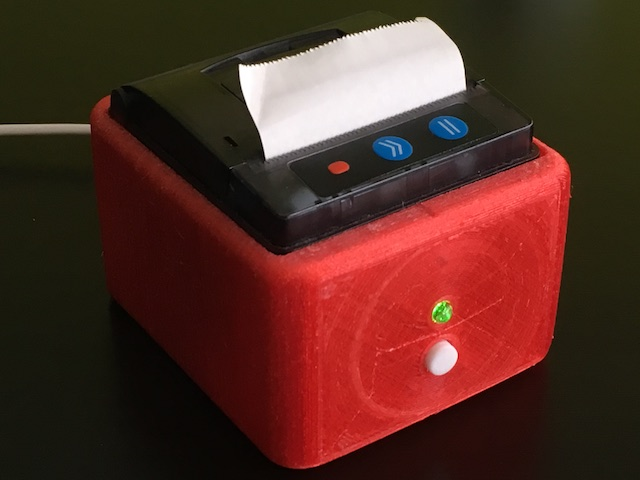

# App Store Review Printer

Lua-only firmware for an autonomous App Store review printer based on NodeMCU and a common thermal printer part.

It sits on your desk checking App Store RSS feed for your iOS app and prints new reviews when they arrive.

## Configuration

The Makefile is tested with OS X only but should work on Linux. It assumes you have the amazing [nodemcu-uploader](https://github.com/kmpm/nodemcu-uploader) installed and that your NodeMCU device has its name matching `/dev/tty.wchusbserial*` pattern.

Rename `config-example.lua` to `config.lua` and adjust to suit your needs.

So far this has been tested with NodeMCU 1.5.4.1 (integer firmware). I've seen the newer one having problems with skipping of network data. 

Only regular modules are required in your firmware (HTTP and JSON parsing are done in Lua):

- bit
- file
- gpio
- net
- node
- struct
- tmr
- wifi

## Printer

Any stock thermal printer should work here, like the ones sold by Adafruit. And as always they have great docs here: https://cdn-learn.adafruit.com/downloads/pdf/mini-thermal-receipt-printer.pdf

Sparkfun also has related docs, though don't rely on all the commands available in every printer: 
https://www.sparkfun.com/datasheets/Components/General/Driver%20board.pdf

Nice intro on the typical ESC codes supported:
https://mike42.me/blog/what-is-escpos-and-how-do-i-use-it

Here is a link for a cheap 58mm one (turned out to be pretty narrow):
https://aliexpress.com/item/JP-QR203-58mm-Mini-Embedded-Receipt-Thermal-Printer-Compatible-with-EML203/32653084570.html

Name on the front: GOOJPRT

TTL connector wires (from left to right when looking at the PCB so the reset button in the top right corner):

        BLACK  - GND
        RED    - VCC
        YELLOW - RX (i.e. the data coming from the controller to the printer here).
        GREEN  - not sure, perhaps TX but could not confirm.
        BLUE   - sort of a BUSY signal: LOW when the printer is ready to accept incoming data; HIGH otherwise.

See `./doc/escpos.pdf` on some of the escape commands supported.
